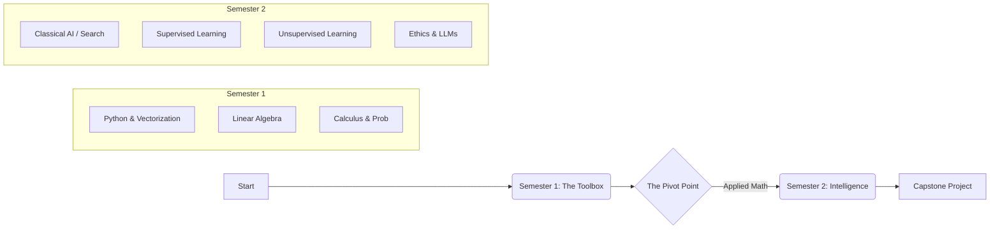

Here is the comprehensive, polished curriculum document.

***

# 🎓 Foundations of AI & Machine Learning
### An Undergraduate Curriculum for "Unshakeable Foundations"

| **Metadata** | **Details** |
| :--- | :--- |
| **Target Audience** | 1st Year Undergraduate Students |
| **Duration** | 2 Semesters (Approx. 30 Weeks) |
| **Prerequisites** | High School Math (Pre-calc), Basic Computer Literacy |
| **Focus** | Computational Efficiency, Mathematical Intuition, Core Logic |
| **Version** | 1.0 (Research-Backed) |

---

## 📖 Table of Contents
1. [Executive Summary](#executive-summary)
2. [Learning Pathway & Prerequisites](#learning-pathway--prerequisites)
3. [Semester 1: The Toolbox (Foundations)](#semester-1-the-toolbox-foundations)
    *   [Module 1: Programming for Data Science](#module-1-programming-for-data-science)
    *   [Module 2: Math I - Linear Algebra](#module-2-math-i---linear-algebra)
    *   [Module 3: Math II - Calculus & Probability](#module-3-math-ii---calculus--probability)
4. [Semester 2: Introduction to Intelligence](#semester-2-introduction-to-intelligence)
    *   [Module 4: Classical AI & Problem Solving](#module-4-classical-ai--problem-solving)
    *   [Module 5: Foundations of Supervised Learning](#module-5-foundations-of-supervised-learning)
    *   [Module 6: Unsupervised Learning](#module-6-unsupervised-learning)
    *   [Module 7: AI Ethics & The Modern Landscape](#module-7-ai-ethics--the-modern-landscape)
5. [Capstone Projects](#capstone-projects)
6. [Resources & Tools](#resources--tools)
7. [Appendix: Methodology](#appendix-methodology)

---

## ⚡ Executive Summary
This curriculum is designed to move beyond superficial tool usage. Research indicates that the distinction between a "programmer" and an "AI Engineer" lies in **computational efficiency** and **mathematical intuition**.

Instead of jumping straight into complex libraries like TensorFlow or PyTorch, this pathway focuses on the "unshakeable foundations":
1.  **Vectorization:** Moving from loops to Single Instruction, Multiple Data (SIMD) operations.
2.  **Math-First Approach:** Understanding the linear algebra and calculus that drive optimization *before* writing the code.
3.  **From Scratch:** Building models manually to demystify the "Black Box."

> 💡 **Philosophy:** "You cannot optimize what you do not understand. We build from the bottom up."

---

## 🗺️ Learning Pathway & Prerequisites

### Prerequisites
*   ✅ **Mathematics:** Basic functions, algebra, and introduction to statistics (mean/median/mode).
*   ✅ **Computing:** Familiarity with file systems, basic logic (if/else), and installing software.

### The Two-Semester Arc



---

# Semester 1: The Toolbox (Foundations)
**Goal:** Master the languages of AI—High-Performance Python & Mathematics.

## 📚 Module 1: Programming for Data Science
**Theme:** *Computational Efficiency & Memory Management*

This is not a generic coding course. It is a rigorous introduction to **Vectorized Computing**. Research shows that Python is the dominant AI language because it acts as a "glue" for C/C++ routines, not because of its own speed.

### 🎯 Learning Objectives
*   **Stop Looping:** Transition from `for` loops to **NumPy** vectorization (SIMD).
*   **Memory Hygiene:** Understand the difference between a "View" and a "Copy" in memory.
*   **Data Wrangling:** Clean messy datasets programmatically.
*   **Visual Debugging:** Use visualization to understand data distribution, not just for aesthetics.

### 🧠 Core Content
1.  **The "No Loop" Rule:** Introduction to NumPy arrays vs. Python Lists.
2.  **Broadcasting:** How dimensions stretch during arithmetic operations.
3.  **Pandas Architecture:** Indexing (`.loc`/`.iloc`), loading CSVs efficiently (`dtypes`).
4.  **Visualization:**
    *   **Seaborn:** For Exploratory Data Analysis (EDA).
    *   **Matplotlib:** For fine-grained plotting control.

### 💻 Technical Example: The Speed of Vectorization
*Students must reproduce this benchmark to understand why we use NumPy.*

```python
import numpy as np
import time

size = 10_000_000
# Scenario: Adding two massive datasets
# ❌ The Wrong Way (Python Loops)
start = time.time()
list_result = [x + x for x in range(size)]
print(f"Loop Time: {time.time() - start:.4f}s")

# ✅ The AI Way (Vectorization)
# Triggers SIMD (Single Instruction, Multiple Data) in the CPU
arr = np.arange(size)
start = time.time()
numpy_result = arr + arr 
print(f"NumPy Time: {time.time() - start:.4f}s")

# Expect NumPy to be ~50-100x faster.
```

### ⚠️ Common Pitfalls & Best Practices
| Concept | The Pitfall | The Fix |
| :--- | :--- | :--- |
| **Pandas** | Using `df[condition]['col'] = val` | Use `.loc[condition, 'col'] = val` to avoid Copy warnings. |
| **Loops** | Iterating rows with `iterrows()` | **Never** loop rows. Use `.apply()` or vectorization. |
| **Shapes** | `(3,)` vs `(3,1)` mismatch | Always check `.shape` and use `.reshape()`. |

### 📝 Assessment
*   **Micro-Project:** "The Data Janitor." Given a corrupted CSV (missing values, wrong types), write a script to clean it and produce a distribution plot of the clean data.

---

## 📚 Module 2: Math I - Linear Algebra
**Theme:** *The Geometry of Data*

ML models are essentially matrices interacting in high-dimensional space. We move from abstract math to code implementation.

### 🎯 Learning Objectives
*   Represent real-world data (images, text stats) as Vectors and Matrices.
*   Understand geometric interpretations (Dot product as "similarity").
*   Grasp Dimensionality Reduction concepts.

### 🧠 Core Content
1.  **Scalars, Vectors, Matrices, Tensors:** Definitions and NumPy implementation.
2.  **Matrix Operations:** Dot Product, Cross Product, Transpose, Inverse.
3.  **Eigenvalues & Eigenvectors:** Understanding them as the "principal axes" of data (Pre-cursor to PCA).
4.  **Space Transformations:** How matrices warp space (rotation, scaling).

### ⭐ Depth Marker
*   **Deep Mastery:** Manual Matrix Multiplication.
*   **Working Knowledge:** Eigen decomposition using `np.linalg.eig`.

---

## 📚 Module 3: Math II - Calculus & Probability
**Theme:** *Optimization & Uncertainty*

How do models learn? (Calculus). How do they handle the unknown? (Probability).

### 🎯 Learning Objectives
*   Calculate gradients to find the "slope" of a function.
*   Apply the Chain Rule (the engine of Neural Networks).
*   Update beliefs using Bayes' Theorem.

### 🧠 Core Content
1.  **Derivatives:** "Slope" as "Rate of Change."
2.  **The Gradient:** The vector of partial derivatives pointing uphill.
3.  **The Chain Rule:** How error propagates through a nested system.
4.  **Probability:**
    *   Conditional Probability & Bayes' Theorem.
    *   Distributions: Normal (Gaussian), Bernoulli, Poisson.

### 📝 Assessment
*   **Paper Exercise:** Calculate the gradient of a simple cost function $J(\theta) = (\theta - 5)^2$ and simulate 3 steps of Gradient Descent by hand.

---

# Semester 2: Introduction to Intelligence
**Goal:** Synthesize foundations to build functional AI systems.

## 📚 Module 4: Classical AI & Problem Solving
**Theme:** *Algorithms & Logic*

Before Machine Learning, there was Symbolic AI. This teaches algorithmic thinking.

### 🎯 Learning Objectives
*   Understand the Agent-Environment loop (PEAS).
*   Implement pathfinding algorithms.
*   Solve adversarial games (Game Theory).

### 🧠 Core Content
1.  **Search Algorithms:** BFS, DFS, and **A* (A-Star)**.
2.  **Adversarial Search:** The **Minimax Algorithm** (Tic-Tac-Toe / Chess bots).
3.  **Constraint Satisfaction:** Solving Sudoku via backtracking.

### 💻 Example: The Agent Loop
```python
# Concept: A simple Reflex Agent
def reflex_agent(location, status):
    if status == "Dirty":
        return "Clean"
    elif location == "A":
        return "Right"
    elif location == "B":
        return "Left"
```

---

## 📚 Module 5: Foundations of Supervised Learning
**Theme:** *Learning from Labeled Data*

The convergence of Module 2 (Math) and Module 3 (Optimization).

### 🎯 Learning Objectives
*   Build Linear Regression **from scratch** (No Scikit-Learn).
*   Understand the Bias-Variance Tradeoff (Overfitting).
*   Evaluate models beyond simple "Accuracy."

### 🧠 Core Content
1.  **Regression:** Linear Regression, Cost Functions (MSE).
2.  **Optimization:** Implementing **Gradient Descent** manually.
3.  **Classification:** Logistic Regression & K-Nearest Neighbors (KNN).
4.  **Evaluation:** Precision, Recall, F1-Score, Train/Test Split.

### 🚀 Practical Task
**The "From Scratch" Challenge:** Implement Linear Regression using only NumPy.
1.  Define the hypothesis $y = mx + b$.
2.  Define the Cost Function (Mean Squared Error).
3.  Update $m$ and $b$ using derivatives derived in Module 3.

---

## 📚 Module 6: Unsupervised Learning
**Theme:** *Finding Hidden Structures*

### 🎯 Learning Objectives
*   Group data without pre-existing labels.
*   Visualize high-dimensional data in 2D/3D.

### 🧠 Core Content
1.  **Clustering:** K-Means Algorithm (and how to choose 'K').
2.  **Dimensionality Reduction:** **PCA (Principal Component Analysis)** applied to datasets.
3.  **Anomaly Detection:** Finding outliers in data streams.

---

## 📚 Module 7: AI Ethics & The Modern Landscape
**Theme:** *Responsibility & The Future*

### 🎯 Learning Objectives
*   Critique systems for bias.
*   Understand the high-level architecture of Deep Learning.

### 🧠 Core Content
1.  **Bias & Fairness:** How data bias becomes model bias.
2.  **Explainability (XAI):** "Black Box" vs. "White Box."
3.  **The Deep Learning Horizon:** Brief intro to Neural Networks and LLMs (Transformers) using APIs.

---

# 🏆 Capstone Projects
*Choose one track to demonstrate mastery of the year's content.*

### Track A: The Housing Price Predictor (Regression)
*   **Data:** Raw CSV of housing data.
*   **Workflow:**
    1.  Clean data using Pandas (Mod 1).
    2.  Visualize correlations using Seaborn (Mod 1).
    3.  Normalize features using Vectorization (Mod 2).
    4.  Train a Linear Regression model (Mod 5).
    5.  Analyze errors/residuals (Mod 3).

### Track B: The Spam Classifier (NLP/Probabilistic)
*   **Data:** Dataset of email text.
*   **Workflow:**
    1.  Preprocess text (Tokenization).
    2.  Convert text to vectors (Bag of Words) (Mod 2).
    3.  Apply Naive Bayes classification (Mod 3).
    4.  Evaluate using Precision/Recall (Spam requires high Precision) (Mod 5).

---

# 🛠️ Resources & Tools

### Software Stack
*   **Language:** Python 3.9+
*   **Environment:** Anaconda or Miniconda (Strict use of Virtual Environments).
*   **IDE:** VS Code or Jupyter Lab.
*   **Core Libraries:** NumPy, Pandas, Matplotlib, Seaborn, Scikit-Learn.

### Recommended Reading
1.  *Python for Data Analysis* by Wes McKinney (Creator of Pandas).
2.  *Mathematics for Machine Learning* by Deisenroth, Faisal, and Ong.
3.  *Artificial Intelligence: A Modern Approach* by Russell & Norvig (Selections).

---

# 📎 Appendix: Methodology
This curriculum was generated based on a synthesis of modern industry requirements and academic standards.
*   **Research Insight:** The deep-dive into Module 1 identified "Vectorization" as the single most critical technical skill often missed in introductory courses.
*   **Structure:** The "Two-Semester" approach aligns with standard university pacing but accelerates the introduction of technical math to prevent "tutorial hell" later in the degree.